# CloudFlare Worker Integration

Step-by-step guide: connect ostr.io pre-rendering to your website via CloudFlare Worker

## ToC

1. [Add domain to CloudFlare](#1-add-domain-to-cloudflare)
2. [Add domain to ostr.io](#2-add-domain-to-ostrio)
3. [Create Worker](#3-create-worker)
4. [Add pre-rendering code](#4-add-pre-rendering-code)
5. [Add API key](#5-add-api-key)
6. [Connect Worker to domain](#6-connect-worker-to-domain)
7. [Purge cache](#7-purge-cache)
8. [Check the result](#8-check-the-result)

---

## 1. Add domain to CloudFlare

1. Open [CloudFlare Sign Up](https://dash.cloudflare.com/sign-up) or [Login](https://dash.cloudflare.com/login)
2. Click __"Account Home"__ in the sidebar > click <kbd>Onboard a domain</kbd>
3. Follow the onboarding steps. At __"Block AI training bots"__ step — select __"Do not block (off)"__

---

## 2. Add domain to ostr.io

1. Open [ostr.io Sign Up](https://ostr.io/signup) or [Login](https://ostr.io/login)
2. Add your domain following the onboarding steps
3. Verify domain ownership — add `DNS TXT` record via CloudFlare DNS settings
4. In the server panel find __"Available Services"__ > click <kbd>add</kbd> next to __"Pre-rendering"__
5. In the pre-rendering panel scroll down and click <kbd>integration guide</kbd>
6. Open the __CLOUDFLARE__ tab > copy the `OSTR_AUTH` value (starts with `Basic ...`) — you will need it in [step 5](#5-add-api-key)

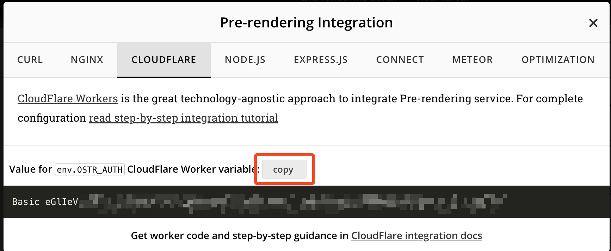

1. Go to "Account Home" in the sidebar
2. __In the sidebar:__ Compute (Workers) > Workers & Pages (*see [UI screenshot](#create-new-worker-from-step-2)*)
3. At __Workers & Pages__ page click on <kbd>Create</kbd> > Then select "Start with Hello World!" (*see [UI screenshot](#create-new-worker-from-hello-world-template-from-step-3)*)
4. __New Worker Form__: Enter memorable name (ex.: `examplecom-seo-worker`) > click on <kbd>Deploy</kbd> (*see [UI screenshot](#create-new-worker-deploy-hello-world-worker-from-step-4)*)
5. After __new Worker__ created > click on <kbd>Edit Code</kbd> (*see [UI screenshot](#create-new-worker-edit-hello-world-worker-from-step-5)*)
6. At __Worker Editor__ > Remove default "Hello World" worker code and replace with [Cloudflare Worker code](cloudflare.worker.js)
7. After Worker's code placed into __Worker Editor__ > click on <kbd>Deploy</kbd> (*see [UI screenshot](#create-new-worker-paste-and-deploy-workers-code-from-step-7)*)
8. __Pass API key to CloudFlare Worker via environment variable__ (*see [UI screenshots](#add-api-key-from-step-8)*)
    - Go to "Workers & Pages" > Open Newly Created Worker > Settings > Variables and Secrets > Click on <kbd>Add</kbd> button:
        - Type: `text`
        - Variable Name: `OSTR_AUTH`
        - Value: Place value (*from "integration guide", see step no.6*) that starts with `Basic ...`
    - Click on <kbd>Deploy</kbd> after adding `OSTR_AUTH` variable
9. __Connect Worker to a website__ (*see [UI screenshots](#connect-worker-to-a-website-from-step-9)*)
    - Go to "Account Home" > Domains > (*click on your domain name*)
    - In sidebar open "__Workers Routes__" > HTTP Routes > click on <kbd>Add Route</kbd>
    - __Add Route__ (*one of below*):
        - Standard (*recommended*): `https://example.com/*` or `https://www.example.com/*` (*if `www.` is your primary website location; __Must include `/*` (slash and asterisk) at the end of route__*)
        - Support both `http:` and `https:` protocols : `*example.com/*`
        - Apply to main domain (TLD) and __all__ subdomains (*PRO and BUSINESS plans only*) `*example.com/*`
        - Apply __only__ to for subdomains __only__ (*PRO and BUSINESS plans only*) `*.example.com/*`
    - __Worker:__ Select newly created worker from dropdown
    - Click on <kbd>save</kbd>
10. __Purge cache at CloudFlare__ (see [UI screenshot](#purge-websites-cache-from-step-10))
    - Go to "Account Home" in the sidebar menu
    - (*click on your domain name*) > Caching > Configuration > <kbd>Purge Everything</kbd>

## 3. Create Worker

1. In CloudFlare sidebar go to __Compute & AI__ > __Workers & Pages__

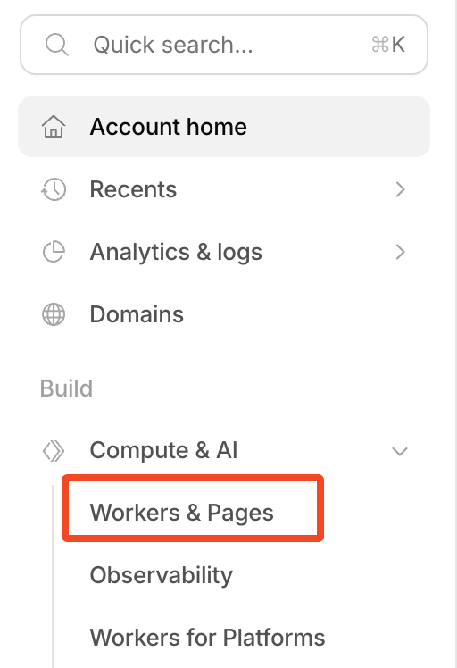

2. Click <kbd>Create application</kbd>

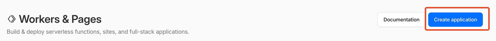

3. Select __"Start with Hello World!"__

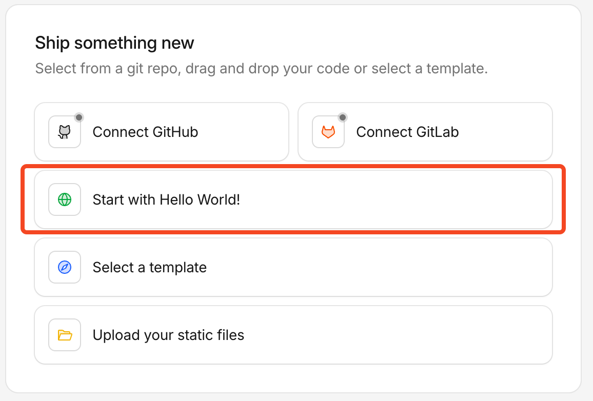

4. Enter a name for the worker (example: `seo-middleware`) > click <kbd>Deploy</kbd>

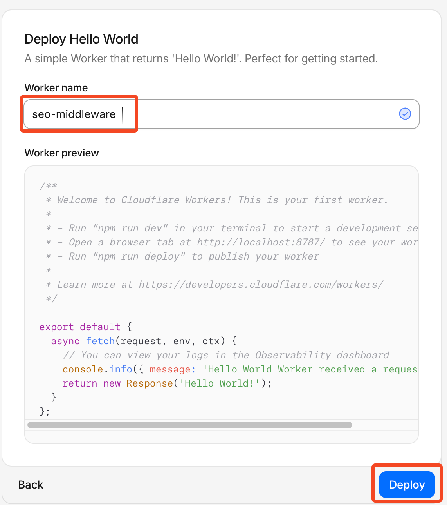

---

## 4. Add pre-rendering code

1. After deploying the worker click <kbd>Edit Code</kbd>

In the editor paste the [pre-rendering worker code](cloudflare.worker.js) and click <kbd>Deploy</kbd>, then click the worker name to go back.


2. Select all code in the editor and delete it

3. Open the [pre-rendering worker script](https://github.com/ostr-io/ostrio-docs/blob/master/docs/prerendering/examples/cloudflare-worker/cloudflare.worker.js) > copy its full contents > paste into the editor

4. Click <kbd>Deploy</kbd> (top-right corner)

5. Click the __worker name__ at the top of the page to go back to the worker overview

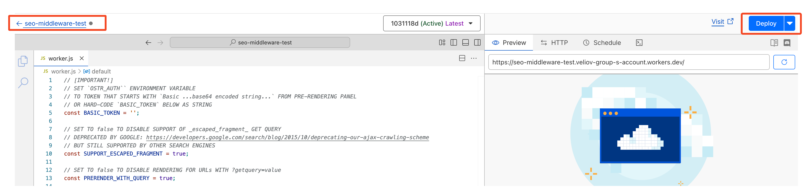

---

## 5. Add API key

1. Open your worker: __Workers & Pages__ > click the worker name
2. Go to __Settings__ > __Variables and Secrets__

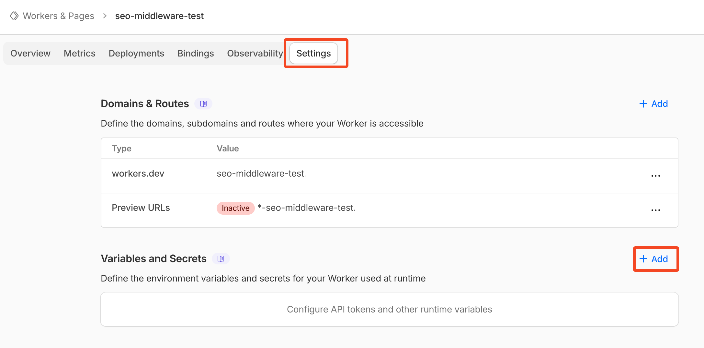

3. Click <kbd>Add</kbd> and enter:
    - __Type:__ `Text`
    - __Variable Name:__ `OSTR_AUTH`
    - __Value:__ paste the value copied in [step 2.6](#2-add-domain-to-ostrio) (starts with `Basic ...`)

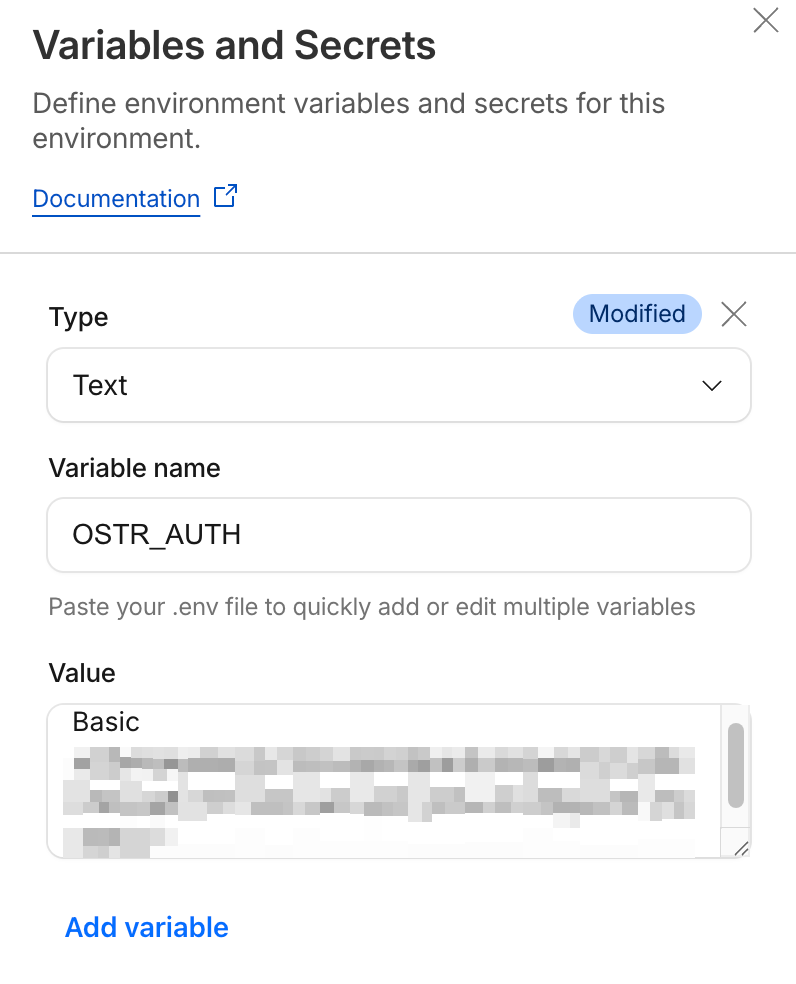

4. Click <kbd>Deploy</kbd>

---

## 6. Connect Worker to domain

1. In the sidebar click __"Account Home"__ > __Domains__ > click your domain name
2. In the sidebar open __Workers Routes__ > __HTTP Routes__
3. Click <kbd>Add Route</kbd>

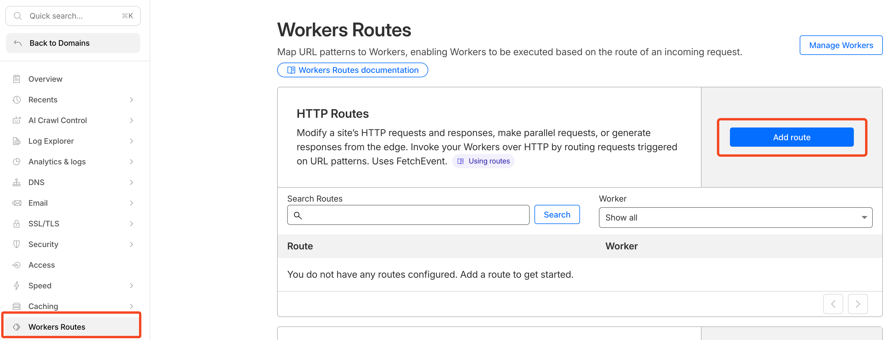

4. In the __Route__ field enter your domain with `/*` at the end:

    | Example | When to use |
    |---|---|
    | `https://example.com/*` | Standard setup (recommended) |
    | `https://www.example.com/*` | If your site uses `www.` |

    > __Replace `example.com` with your actual domain name. Always end the route with `/*`__

5. In the __Worker__ dropdown — select the worker created in [step 3](#3-create-worker)

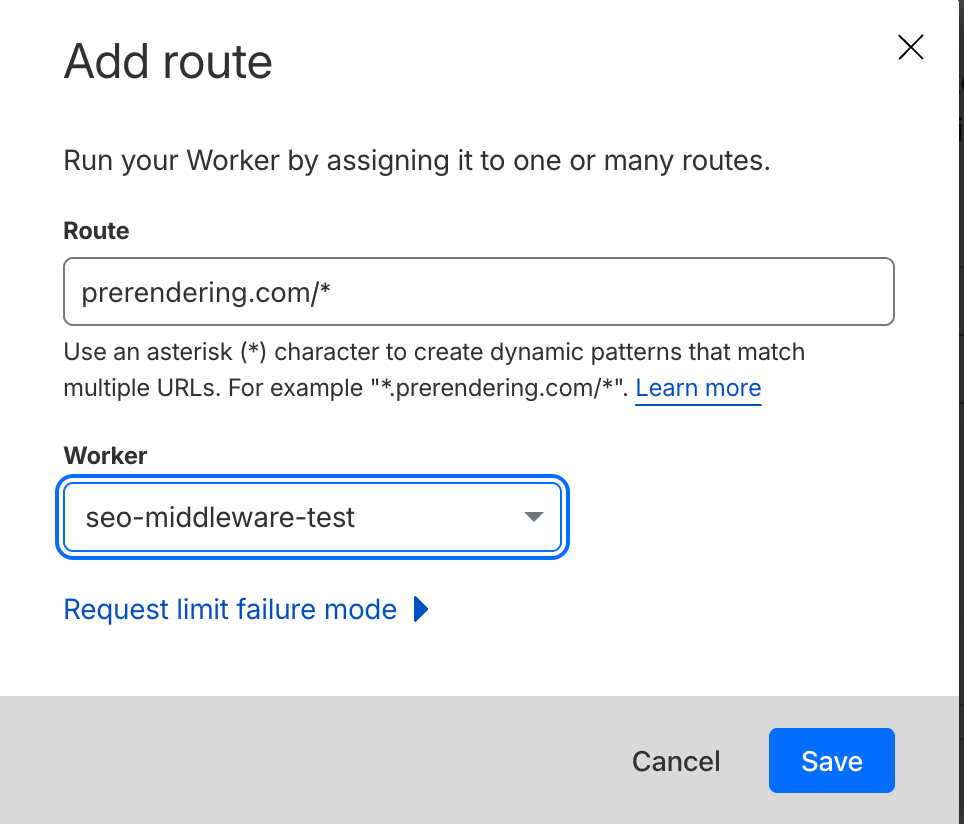

6. Click <kbd>Save</kbd>

---

## 7. Purge cache

1. Go to __Account Home__ > click your domain name
2. Open __Caching__ > __Configuration__
3. Click <kbd>Purge Everything</kbd> > confirm

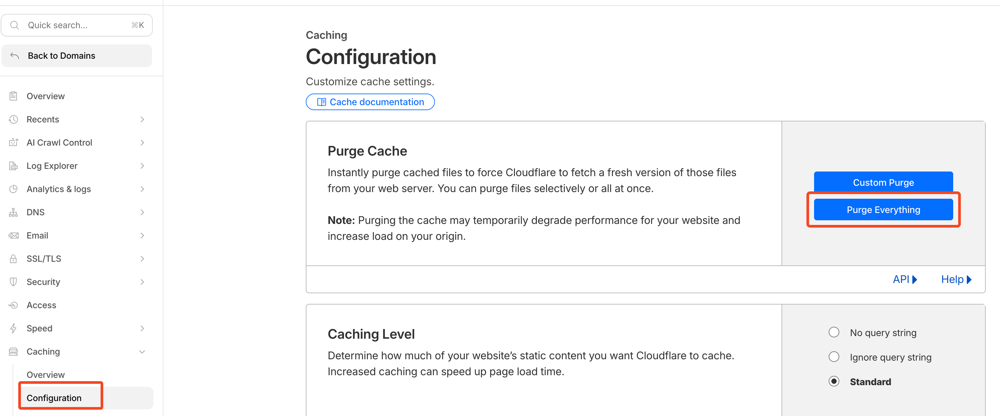

Setup is complete, congratulations! 🎉

---

## 8. Check the result

Open your website in a browser and verify that pre-rendering is working.

### Via Browser

1. Open DevTools:
    - Windows: <kbd>F12</kbd>
    - macOS: <kbd>Option</kbd> + <kbd>⌘</kbd> + <kbd>I</kbd>

2. Open the __Network__ tab > check __"Disable Cache"__

3. In the address bar add `?_escaped_fragment_=` to your URL and press <kbd>Enter</kbd>:

    ```
    https://example.com/?_escaped_fragment_=/
    ```

4. Click the first request in the Network tab > find `X-Prerender-Id` in __Response Headers__

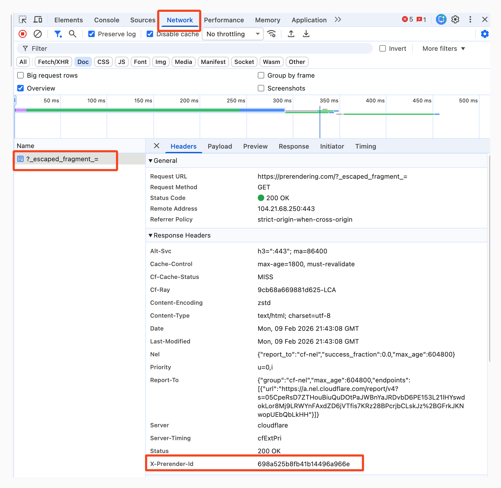

> If `X-Prerender-Id` is present — pre-rendering is working

### Via Terminal

Run this command (replace `example.com` with your domain):

```bash
curl --head -A GoogleBot "https://example.com/"
```

Look for `X-Prerender-Id` in the response. If present — everything works.

---

## Further reading

- 🏎️ [Speed up rendering](../../optimization.md#speed-up-rendering)
- 🤖 [Detect requests from pre-rendering](../../detect-prerendering.md)
- 📔 [Detailed pre-rendering service documentation](../../README.md)
